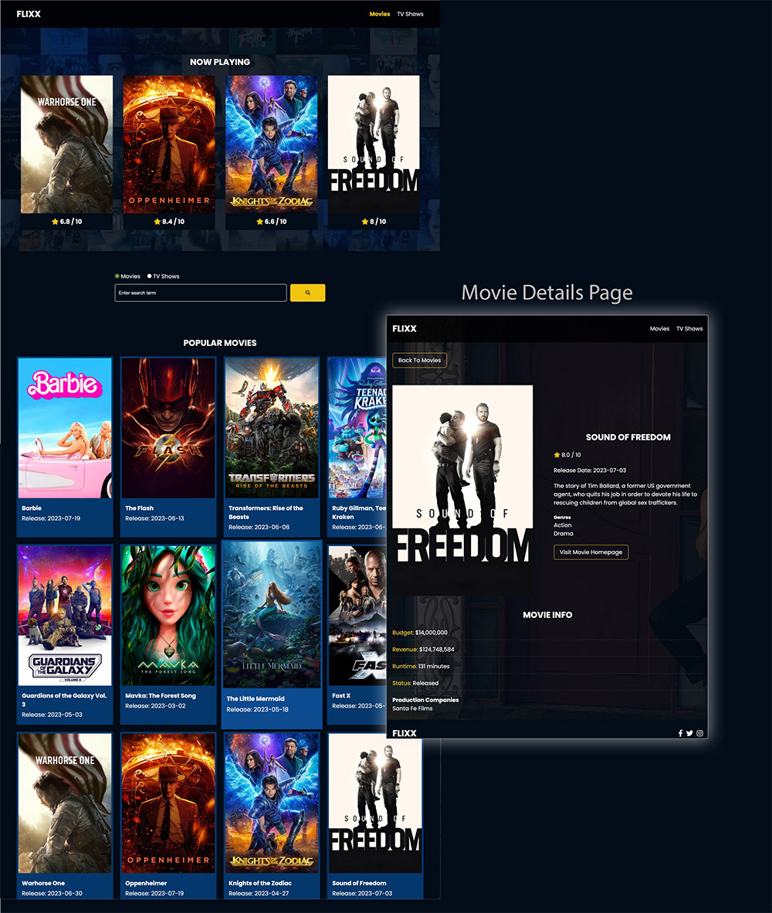

# Flixx App  

This is a movie application made without a framework - just Vanilla JavaScript that uses **version 3** of the [TMDB API](https://developers.themoviedb.org/3)

This is part of Brad Traverersy's **Modern JS From The Beginning 2.0** course  

Per the course; this pulls from the TMDB API, has full search functionality, uses [Swiper.js](https://swiperjs.com/) for the hero rotator, pagination and many other features.  

This was a fun project to work on! Thank you Brad Traveresy!

## Screen cap of final page
>